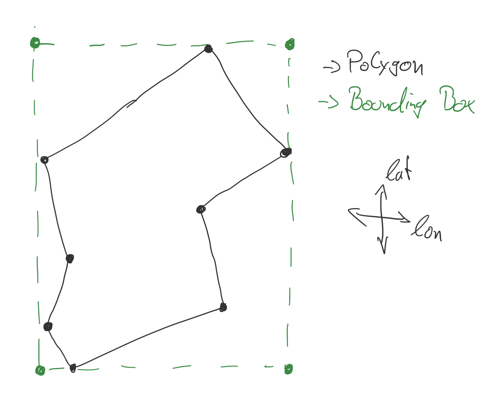

# GeoJSON

https://geojson.org/

GeoJson unterstützt die folgenden Typen:

- Point
- LineString
- **Polygon**
- MultiPoint
- MultiLineString
- MultiPolygon

Man kann diesen einfachen Objekten weitere Eigenschaften (Properties) zuordnen. Diese stellen dann zusammen ein **
Feature** dar.
Mehrere solcher Features werden in einer **FeatureCollection** zusammengefasst.

Die Eigenschaften können selbst gewählt werden.

## Beispiel GeoJSON

```json
{
  "type": "FeatureCollection",
  "features": [
    {
      "type": "Feature",
      "geometry": {
        "type": "Polygon",
        "coordinates": [
          [[100.0, 0.0], [101.0, 0.0], [101.0, 1.0], [100.0, 1.0], [100.0, 0.0]]
        ]
      },
      "properties": {
        "creator": "Routing-0.0.1",
        "name": "BeispielGeoJSON",
        "track-length": "42457",
        "messages": [
          [
            "Longitude",
            "Latitude",
            "Elevation"
          ],
          [
            "9907851",
            "51203074",
            "320"
          ]
        ],
        "times": [
          0,
          18.124,
          32.011,
          43.177,
          45.647,
          48.751
        ]
      }
    },
    {
      ...
    }
  ]
}
```

## Routing Format für die Drohne

Für unsere Routing und die damit verbundenen Zonen benötigen wir als Typ lediglich Poygone und die **Bounding Box** als
Eigenschaft.

## Bounding Box

Um die Suche nach dem Polygon zu vereinfachen, brauchen wir die Box, welche ein Polygon an deren maximalen sowie
minimalen Grenzen umschließt.


### Generier BoundingBox
```js
        "bounding-box": {
          "left-top": {
            "lat": 500,
            "lon": 50
          },
          "right-bottom": {
            "lat": 50,
            "lon": 500
          }
        }
```

- left-top lat = max lat
- left-top lon = min lon
- right-bottom lat = min lat
- right-bottom lon = max lon

### Finde alle Zonen, die für den Punkt relevant seien können

```js
function findRelevantZones(Point) {
    val
    relevantZones = List < Polygon >
        forEach(Polygon in Polygons)
    {
        if (isZoneRelevant(Polygon, Point)) {
            relevantZones.add(Polygon)
        }
    }
    return relevantZones
}
```

### Prüfe ob ein Punkt in der BoundingBox liegt

Hier gibt es 2 Varianten:

#### RayCast Algorithmus

Wenn wir den [RayCast Algorithmus](../Ray-Casting-Algorithm) nutzen, haben wir ein Einheitliches vorgehen, dieser
ist aber zeitaufwendig und bei gerade im Raum liegenden Rechtecken nicht effizient.

#### Eigene Funktion

Eine schlankere und auch schnellere Methode wäre es einfach zu prüfen ob der ausgewählte Punkt sich zwischen den
einzelnen Eckpunkten der BoundingBox befindet.
```js
function isZoneRelevant(Polygon, Point) {
    return Polygon.Propertie.BoundingBox.leftTop.lat > Point.lat &&
        Polygon.Propertie.BoundingBox.leftTop.lon < Point.lon &&
        Polygon.Propertie.BoundingBox.leftTop.lat < Point.lat &&
        Polygon.Propertie.BoundingBox.leftTop.lon > Point.lon;
}
```

Da wir in diesem Fall in der If-Abfrage nur mit dem [AND-Operator](https://developer.mozilla.org/en-US/docs/Web/JavaScript/Reference/Operators/Logical_AND) arbeiten, wird die Berechnung beim ersten `false` abgebrochen. Somit ist diese Version im Idealfall schon nach der ersten Abfrage Beendet und die anderen werden nicht weter betrachtet. Das spaart Performance:


### Generiere 