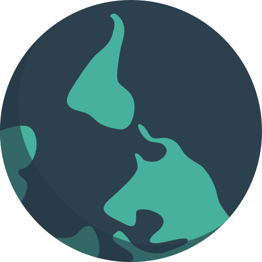

## Visualisierung der Karte

Für die visualisierung nutzen wir ebenfalls die Programmiersprache `P5JS`. Als Framework für das Arbeiten mit einer
interaktiven Karte wird [Mappa.JS](https://mappa.js.org/) verwendet, da dieses Framework initial für `P5JS` entwickelt
wurde und somit eine gute Integration bietet.
<p align="center">

Mappa JS
</p>

### Installation

Das Framework wird am besten über einen Paketmanager wie npm installiert.

```bash
npm install mappa-mundi
```

### Beispielanwendung
Ein einfaches Beispiel findet sich auf der Seite von Mappa:
https://mappa.js.org/docs/simple-map.html

## Polygon Karten Tool
Um sich schnell ein Polygon im GeoJson Format erzeugen zu lassen, kann man folgendes Tool nutzen:
http://apps.headwallphotonics.com/