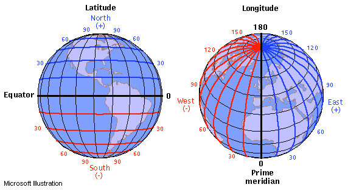
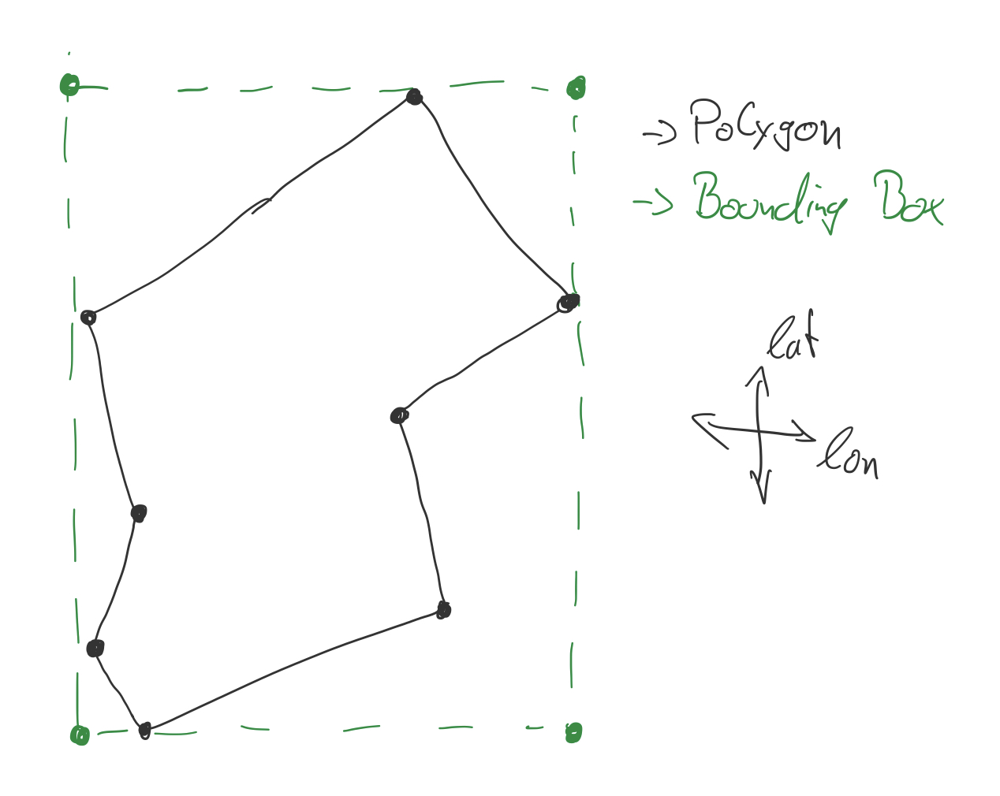
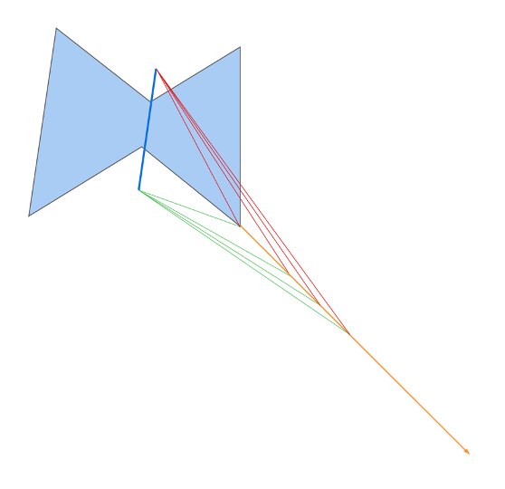
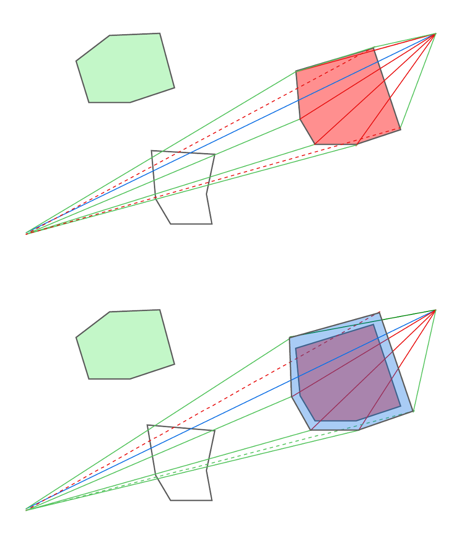
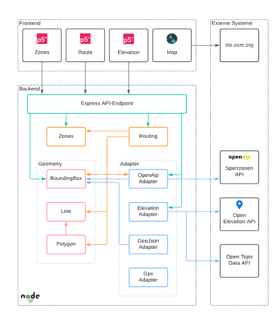
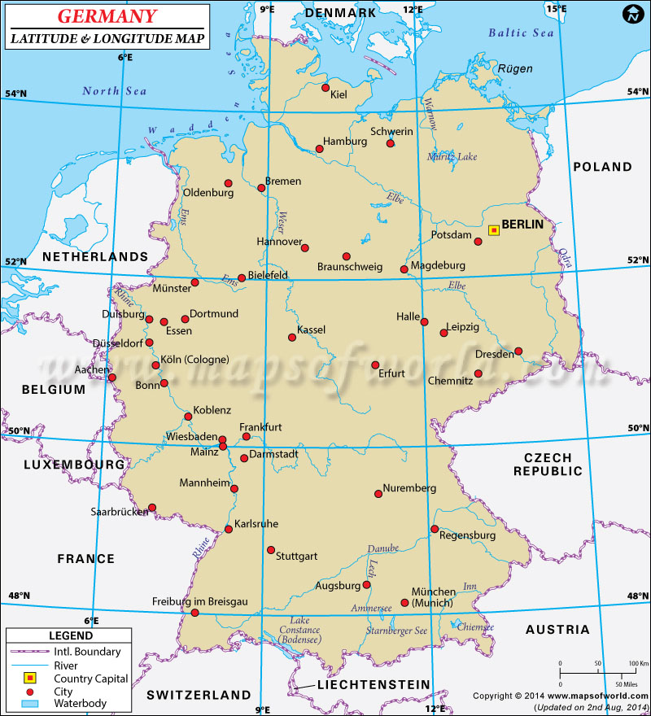
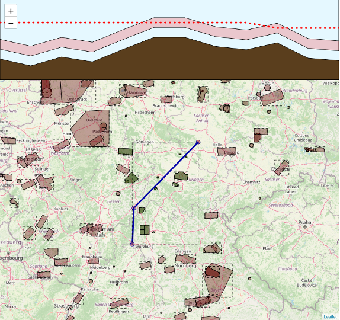

Was muss geschrieben werden, damit jemand anderes versteht was wir gemacht haben
- Worum geht es
- Ich bin Experte?
- Anreiz schaffen, dass er Interesse hat
- aktueller Stand
- offene Themen
    - wo gehts weiter
    - was sind so Probleme

# _Abstract---_

# Einleitung
- Projekteinordnung Blutprobe, dementsprechende Einschränkungen und Relevanz
- aber betonen, dass die Technologie auch in jedem anderen Kontext funktioniert und gebraucht wird
- warum ist Drohnenrouting wichtig
- warum ist es schwierig

Grundlegende Problemstellung sei der Transport von Blutproben zwischen Unfallort und Labor durch ein speziell zu diesem Zweck entwickeltes Fluggerät.
Bestenfalls könnte bei Eintreffen eines verunfallten Patienten im Krankenhaus nicht nur die Blutanalyse bereits durchgeführt sein.
Sogar die passenden Blutkonserven könnten zuvor zur Verfügung gestellt worden sein.
Der Erfolg der Behandlung schwerer Verletzungen und damit auch die Überlebenschancen von Unfallopfern würden hierdurch gesteigert.

Aus der Problemstellung ergeben sich folgende Anforderungen an das Fluggerät:
Um in Innenstädten agieren zu können, muss es sich um ein VTOL (Vertical Take Off and Landing) handeln.
Das Fluggerät soll zudem eine hohe Reichweite haben, was hauptsächlich durch die Möglichkeit zum Gleitflug erreicht werden kann.
Beschleunigungskräfte müssen durch langsamere Geschwindigkeitsänderungen reduziert werden, um die Blutproben zu erhalten.
Rechtliche Aspekte sollen zunächst außer Acht gelassen werden.

Diese Arbeit setzt sich mit der Planung der Flugroute auseinander.
Insbesondere müssen dazu Höhendaten und Gebiete mit beschränktem Flugbetrieb berücksichtigt werden.
Ferner wird auf algorithmische Ansätze zur Umgehung besagter Verbotszonen, sowie Relevanz und Umsetzung der Visualisierung des Projekts, eingegangen.
Die Ergebnisse sind dabei unmittelbar auch in anderen Projekten einsetzbar.

# Routing
## Geo-Informations-Grundlagen
- Longitude, Latitude
- Höhendaten: Luftraum / Flughöhe (Gesetze) -- 150m
- Datenquellen Höhendaten, Sperrzonen, Kartendaten
- höchstes Bauwerk: Fernsehturm 368m > 150m -> Kollisionserkennung notwendig
- Sperrzonen

Geo-informationstechnische Grundlagen

Jeder Punkt auf der Erdkugel wird eindeutig durch die Kombination eines Breiten- und eines Längengrades definiert.
Breitengrade (Latitudes) liegen stets im Bereich von -90° (Süden) bis 90° (Norden). 0° beschreibt den Äquator.
Längengrade (Longitudes) werden von -180° (westlich) bis 180° (östlich) angegeben. Bei 0° befindet sich der Nullmeridian (Prime Meridian), welcher durch Greenwich (GB) verläuft.
Hierbei ergibt sich ein wesentliches mathematisches Problem.
Da -180° und +180° aufeinanderliegen, ist die rein mathematische Differenz zweier unmittelbar um diesen Meridian gelegenen Punkte größer als jede andere Differenz zweier Punkte.
Ein weiteres Problem ist die Uneinigkeit verschiedener Spezifikationen und Normen über die Reihenfolge der beiden Werte.
In diesem Projekt wird stets mit <longitude, latitude> gearbeitet.


Für die Erfassung von Höhendaten gab es in der Vergangenheit verschiedene Projekte und Techniken.
Darunter fallen beispielsweise Lidar, Radar und Stereo-Photogrammetrie. Die so ermittelten Datensätze werden wiederum von verschiedenen Anbietern zur Verfügung gestellt. Das vorgestellte Routingsystem unterstützt dabei wahlweise Open-Elevation oder OpenTopodata.
Mit einer geplanten Flughöhe von 150 m über dem Boden wird die Wahrscheinlichkeit einer Kollision mit menschengemachten Bauten zwar drastisch reduziert, jedoch gibt es einige Ausnahmen, etwa den Berliner Fernsehturm mit einer Höhe von über 350 m. Dies ist beim Einsatz in neuen Regionen zu beachten und zu planen. Um betreffende Bauwerke können manuell Sperrzonen eingerichtet werden. Trotzdem sollte die Flugsteuerung mit Kamera, Bilderkennung und einem Ausweichmechanismus gekoppelt sein. 
Sogenannte Sperrzonen, welche aus sicherheitstechnischen Gründen nicht überflogen werden dürfen, da sie beispielsweise von militärischer Relevanz oder für den Regelflugbetrieb reserviert sind, werden über die Schnittstelle openAIP bezogen.


## Algorithmik
- GeoJSON als Standard/Format
  - überführt in eigenes einheitliches Format
- Recheneffizienz (BoundingBox), relevant Zones
  - nur relevante Zonen werden betrachtet
  - um die Route und die Zonen liegt eine Boundingbox
  - schneidet die Boundigbox der route eine boundingbox der zonen, dann wird die Zone betrachtet
  - alle anderen nicht
- Abtastung der Route für Höhe
  - openTopodata als Datenquelle für Höhendaten
  - route wird in kleinen Abständen abgetastet
  - versuch innerhalb des korridors (min - max Flughöhe) möglichst gerade zu fliegen
  - somit wenig höhenkorrekturen
- offene Probleme: 
  - landet ein routenpunkt in einer konkaven geometrie einer Zone, dann läuft der Algorithmus noch ins unendliche
  - hier gibt es bereits verschiedene Lösungsansätze
    - A*-Algorithmus
    - IDA*
    - oder indem man Eckpuntke als zwischenpunkte einbaut, um so dem konkaven zu entkommen
  - Die Route nimmt aktuell auch noch den erst besten Weg. Dieser ist aber nicht zwingend der effizienteste. Hier kann man mit verschiedenen Optimierungsverfahren arbeiten.


Als Format für die Datenbasis wurde sich für GeoJSON als Standard-/Format verwendet. Es ist ein weitverbreitetes und offenes Format, das die Beschreibung geografischer Daten ermöglicht. Es wurde für den Zweck der besseren Benutzung in ein eigenes einheitliches Format überführt. Hierbei sind nur leichte Anpassungen entstanden. Die größten Änderungen waren dabei, die Koordinaten nicht als Array, sondern als Objekt zu speichern. Dies erleichtert die Verarbeitung der Daten, wie der Zugriff über den Namen (Value) und nicht über den Index erfolgt.

```js
// Zugriff über Index
feature.geometry.coordinate[0];

// Zugriff über Value
feature.geometry.coordinate.lat;
```

Dies ist besonders entscheidend, da die Reihenfolge von lat und lon nicht einheitlich ist. Mit der Verwendung des Objektes ist der Zugriff immer eindeutig.

Ein wichtiger Faktor ist die Recheneffizienz. Um diese zu erhöhen, werden nur relevante Zonen betrachtet. Hierfür wird eine Bounding-Box um die Route und die Zonen gelegt. Wenn die Bounding-Box der Route eine Bounding-Box der Zonen schneidet, wird die Zone betrachtet, ansonsten nicht. Dies reduziert die Anzahl der zu betrachtenden Zonen erheblich und erhöht somit die Recheneffizienz.


OpenTopoData wird als Datenquelle für die Höhendaten verwendet. Die Route wird in kleinen Abständen abgetastet, dabei wird versucht, innerhalb des Korridors (min - max Flughöhe) möglichst gerade zu fliegen. Dies reduziert die Anzahl der Höhenkorrekturen.

Es gibt jedoch auch offene Probleme, die gelöst werden müssen. Ein Problem ist die Behandlung von konkaven Geometrien von Zonen.

Hier landet ein Routenpunkt in einer konkaven Geometrie einer Zone und der Algorithmus läuft ins Unendliche. Es gibt bereits verschiedene Lösungsansätze wie den A*-Algorithmus, IDA* oder indem Eckpunkte der Zone als Zwischenpunkte eingebaut werden, um dem Konkaven zu entkommen.

Ein weiteres Problem ist die Optimierung der Route. Derzeit wird der erstbeste Weg genommen, dieser ist jedoch nicht zwingend der effizienteste. Hier können verschiedene Optimierungsverfahren angewendet werden, um die Routeneffizienz zu verbessern.



- 
- 
- 
- 


## Visualisierung


In diesem Abschnitt wird die Visualisierung der Karte mit Sperrzonen und Routen beschrieben. Die interaktive Visualisierung ermöglicht es dem Nutzer, mit der Maus Start-, Zwischen- und Endpunkte zu setzen, um die Route berechnen zu lassen. Als Programmiersprache wurde P5JS verwendet, welches ein einfaches Framework zur Visualisierung von geometrischen Formen als Webanwendung direkt im Browser ist. Für das Arbeiten mit interaktiven Karten wurde Mappa.JS als Framework gewählt wurde, da es ursprünglich für P5JS entwickelt wurde und somit eine gute Integration bietet.

Der Zeichenbereich setzt sich aus zwei Bereichen zusammen.
Im oberen Bereich der Visualisierung wird ein Höhenprofil der Route dargestellt, sowie ein Korridor, innerhalb dessen sich die Drohne bewegen darf. Dieser Korridor hängt von der Höhe der Drohne und der Bodenhöhe ab.
Im unteren Bereich befindet sich dann die interaktive Karte, auf der die Sperrzonen und die Route dargestellt werden.

Jede Route und Sperrzone ist dabei ein Array von Koordinaten, die in der Karte dargestellt werden. Routen werden in der Karte mit einem blauen Pfad dargestellt, während Sperrzonen als rote Bereiche dargestellt werden.

Diese Visualisierung war nicht direkter Bestandteil der Arbeit,  stellte sich jedoch als wichtig für die Nachvollziehbarkeit der Korrektheit der Berechnungen sowie zur Veranschaulichung und Erklärung der Vorgänge heraus.

# Fazit
Die Untersuchung des Routing-Problems von Drohnen, welches in dieser Arbeit adressiert wurde, hat sich als komplexer erwiesen als ursprünglich vermutet. Es gibt eine Vielzahl von Standards und Regeln, die berücksichtigt werden müssen, was die Entwicklung einer einheitlichen Lösung erschwert hat. Insbesondere die verschiedenen Geo-Formate in ein einheitliches Format zu wandeln verursachte viel Kommunikationsbedarf. Die Tatsache, dass Geo-Koordinaten nicht einheitlich gespeichert werden und die Reihenfolge von Latitude und Longitude variieren, war einer der zeitintensiven Abschnitte dieser Arbeit.

Die Visualisierung war nicht Teil der Aufgabenstellung, hat aber wesentlich für das Verständnis der Aufgabe beigetragen. Die Verwendung einer Geometry-Library hätte die Arbeit erleichtert, indem es mehr Zeit für Entscheidungsfindung und Optimierungen der Anwendung geschaffen hätte. Trotz des erhöhten Aufwands war das Thema jedoch angenehm und spannend. Das Proof of Concept hat gezeigt, dass es möglich ist, eine Lösung zu finden, jedoch erfordert es weitere Optimierungen und Anpassungen, um ein optimales Ergebnis zu erzielen.